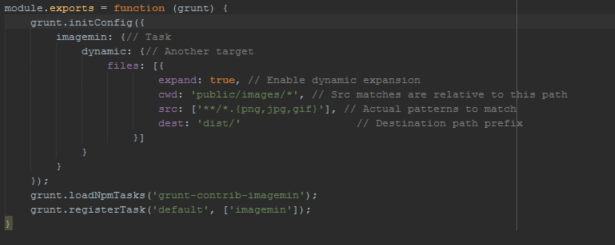
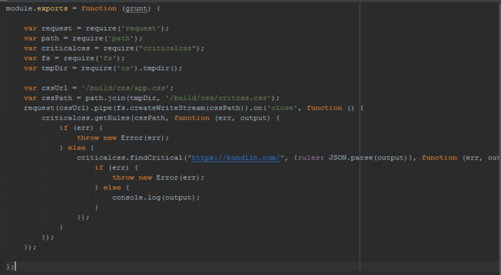
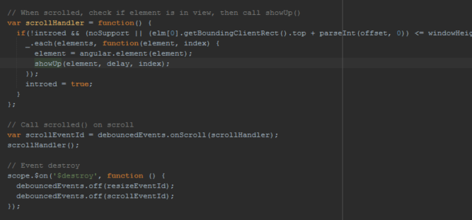
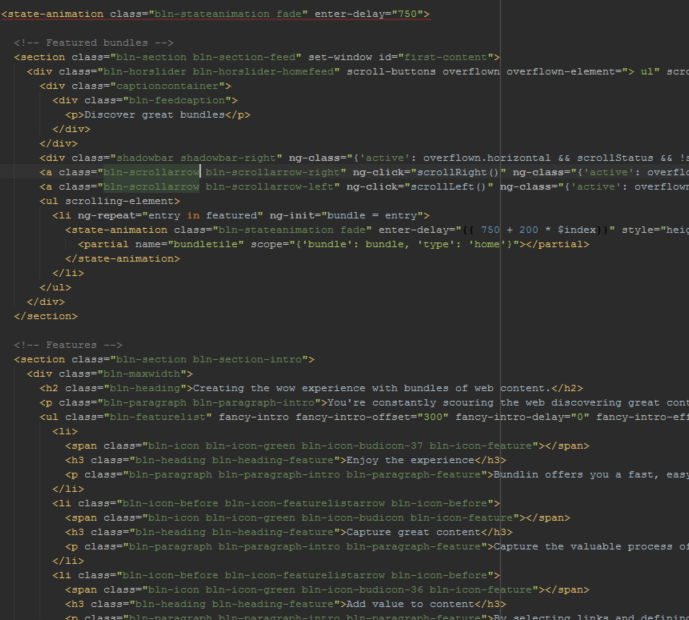
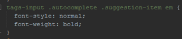
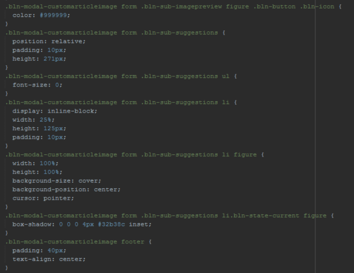
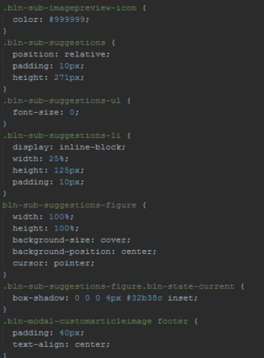

#Bundlin.com

##Improvements to be made

* mobile loadtime
* above the fold css
* scroll performance
* buildtool improvements
* html/css optimalisatie

##Mobile loadtime
Images

Images zijn momenteel niet geoptimized, zo heb ik in de build tool Grunt een nieuwe task aangemaakt die de images minified.

##Above the fold css (critical css)
Critical CSS

Aangezien de CSS onderverdeeld is in modules is het vrijwel onmogelijk een critical css file aan te maken voor het builden voor above the fold loading. Hiervoor pakken we dus de compressed CSS die al via grunt aangemaakt wordt en laten we hiervoor een critical css file genereren. In de homepage html files willen we vervolgens de CSS inline zetten en in iedergeval bovenaan in de HTML.

https://github.com/filamentgroup/criticalCSS

##Scroll performance

Zoals in het bovenstaande stuk code te zien worden er op scroll actions nieuwe items ingeladen. Leuke manier van lazyloading maar erg traag en zwaar voor bijvoorbeeld een mobieltje. Een oplossing hiervoor zou zijn om items async in te laden (gebeurd geloof ik nu niet?). Wat wel al gedaan is is het juist implementeren van debounce funties (zodat de functie niet vaker dan 1x kan afvuren) waardoor het de grootste problemen van JS op de scroll al verhelpt.

##Buildtool improvements
Bij critical css hebben we al gekeken een extra grunt task. Voor buildtool improvements zou ik aanraden aan lifely om over te stappen op gulp. Tijdens de presentatie hoorde ik al wel dat ze dit voor huidige projecten al wel doen. 

Een paar redenen waarom ik gulp beter vind dan grunt:

* Makkelijker op te zetten
* Grunt checked het hele project elke keer wanneer er ook maar 1 change is, gulp doet dit niet dus veel sneller
* Grunt = config, Gulp = code
* Gulp gebruikt streams dus is een heel stuk sneller.

##HTML/CSS Optimization

Voor dit project is gebruikt gemaakt van angular. Wat betreft HTML optimization verandert dit dus een hoop aangezien zij gebruik maken van inline if statements en animations via angular. Wat deels ontbreekt in de huidige opbouw van de HTML is het semantisch maken hiervan. Er zijn lijkt wel random overal articles en sections geplaatst met daarin een hele hoop div's om de animations goed te laten werken. Maar wat als dit wegvalt? Of als ik dit allemaal helemaal niet wil zien? 

Wat ook erg opvalt in de CSS is de benaming van elementen. De selectors zijn vaak onnodig lang en eindigen op een generiek element die als eerste zal worden gezocht in de HTML waardoor de CSS slomer is.

Kan natuurlijk ook zo:

##Font Icons & Animations

Er zitten een hoop leuke animaties in maar deze zijn erg pijnlijk voor de perforance, een alternatief voor sloom ladende clients (bijv. mobile) zou misschien moeten zijn om png's te gebruiken zonder animatie.
Wanneer je een bepaalde font niet hebt ontbreekt het stuk text nu op de website (hier gaat het voor zover ik heb gevonden alleen over icons). Een oplossing hiervoor is om deze naar svg te zetten, zo kunnen er ook geen rare dingen fout gaan wanneer een font niet aanwezig is en lost het ook het probleem op van een fontobserver implementereren waar je dan een hele lelijke andere font krijgt (dit is niet echt netjes voor een logo/icon bijv. namelijk).
